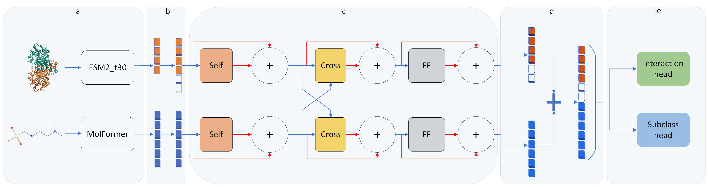
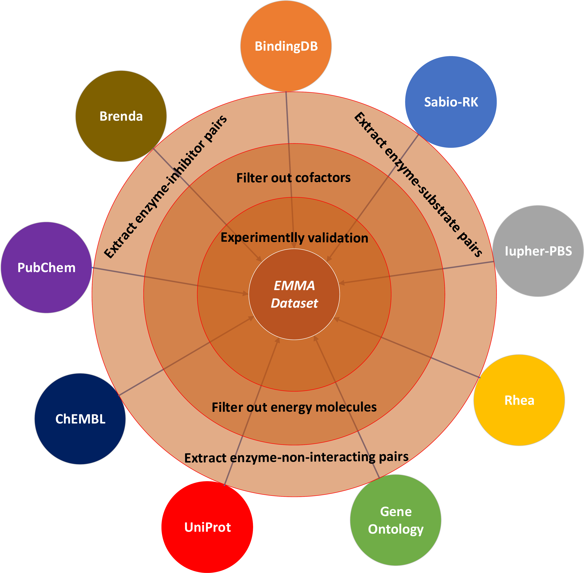

*Figure 1: The overall architecture of the EMMA multi-task learning framework. Self, Cross and FF are abbreviations 
for self-attention and cross-attention and feed-forward, respectively. Red arrows represent residual connection followed by 
normalization (summation sign). (a) Modality-specific encoders. (b) Projection block. (c) Dual-stream transformer mechanisms. 
(d) Concatenation. (e) Task-specific prediction heads.*
# Description:
Predicting enzyme–small molecule interactions is critical for drug discovery. 
While recent deep learning approaches have shown promising results, several challenges remain: 
the lack of a comprehensive dataset, the need to capture enzyme–small molecule interaction signals, 
the tendency of previous models to simplify the problem as enzyme–substrate vs. enzyme--non-interacting, 
thereby, misclassify enzyme–inhibitor pairs as substrates, and the true impact of data leakage on model performance. 
To address these issues, we present EMMA, a transformer-based multi-task learning framework designed to 
learn pairwise interaction signals between enzymes and small molecules while adapting to out-of-distribution data. 
EMMA operates directly on SMILES strings and enzyme sequences, 
with two classification heads that distinguish enzyme–substrate, enzyme–non-interacting, and enzyme–inhibitor pairs. 
By evaluating EMMA under four distinct data-splitting regimes that control for different types of leakage, 
we demonstrate that EMMA achieves strong and robust performance, particularly on novel enzyme–small molecule combinations. 

## Table of Contents:
- [Setup Instructions](#setup-instructions)
  - [Folder Structure](#folder-structure)
  - [Setting up `EMMA` Environment](#setting-up-sip-environment)
- [Creating EMMA Dataset](#creating-emma-dataset)
  - [1-Search_GO_annotation.py]()
  - .
  - .
  - .
  - [12-Pooling_All_Data.py]()
- [Embedding](#embedding)
  - [13-1-MoLFormer-XL.py](#smiles)
  - [13-2-ESM2_t30.py](#enzyme)
- [Data Splitting](#data-splitting)
  - [14-1-SplitByDataSAIL.py]()
  - [14-2-SplitByDataSAIL_LabelBased.py]()
- [Map Embedding To Splits](#map-embedding-to-splits)
  - [15-MapEmbeddingsOutputsToIDs.py]()
- [Training EMMA](#training-emma)
  - [16-SelfCrossAttentionDualStreamTransformer.py]()
- [Results and Analysis](#results-and-analysis)
  - [17-1-Data_leakage_calculation.py]()
  - [17-2-Results_and_Analysis.ipynb]()

## Setup Instructions:
###  Folder structure:
```
├── EMMA/
│ ├── data/
│ │ ├── Embedded_sequences_t30/
│ │ ├── Embedded_smiles/
│ │ ├── processed_data/
│ │ ├── raw_data/
│ │ ├── splits/
│ │ ├── trained_models/
│ │ └── training_test_results/
│ ├── code/
│ ├── additional_code/
│ ├── utilities/
│ ├── EMMA.png
│ ├── EMMA_dataset.png
│ └── README.md

```

### Setting up `EMMA` Environment:
      conda create --name EMMA python=3.12.0
      conda activate EMMA
      conda config --set channel_priority strict
      conda config --set solver libmamba
      conda install mamba -n EMMA -c conda-forge
      mamba clean -a
      mamba install -c conda-forge -c bioconda -c kalininalab datasail
      conda install conda-forge::biopython
      conda install pytorch torchvision torchaudio pytorch-cuda=12.1 -c pytorch -c nvidia
      conda install numpy=1.26.4
      conda install pandas=2.2.3
      conda install conda-forge::rdkit
      conda install -c conda-forge seaborn
      pip:
          - transformers==4.48.1
          - scipy==1.15.2
          - scikit-learn==1.6.1
          - rdkit-pypi==2025.3.2
          - chemdataextractor==1.3.0
          - chembl_webresource_client==0.10.9
          - libchebipy==1.0.10
          - matplotlib==3.10.1
          - seaborn==0.13.2
          - fair-esm==2.0.0
          - py-cd-hit==1.1.4
          - tqdm==4.67.1
          - colorama==0.4.6
          - requests==2.32.3
          - grakel
          - pytorch-toolbelt
          - wandb==0.19.8

## Creating EMMA Dataset:
<figure>
  
  <figcaption><em>Figure 1: Overview of EMMA dataset processing steps and its sources </em></figcaption>
</figure>

## Embedding:

  Run:

        python 13-1-MolFormer_XL.py --input-path ./../data/processed_data/Final_Dataset.pkl --output-path ./../data/Embedded_smiles/
        python 13-2-ESM2_t30.py  --input-path ./../data/processed_data/Final_Dataset.pkl --output-path ./../data/Embedded_sequences_t30/

## Data Splitting

This table outlines an overview of all different split strategies used in this project, including the number of training and test samples as well as the ratios of enzyme–inhibitor, enzyme–substrate, and enzyme–non-interacting pairs.

| Split Method      | Train Samples | Test Samples | Enz–Inh / Enz–Sub (Train) | Enz–Inh / Enz–Sub (Test) | Enz–Sub / Enz–NI (Train) | Enz–Sub / Enz–NI (Test) | Enz–Inh / Enz–NI (Train) | Enz–Inh / Enz–NI (Test) |
|------------------|---------------|--------------|---------------------------|--------------------------|--------------------------|-------------------------|--------------------------|-------------------------|
| Enzyme-based      | 117,771       | 29,453       | 0.985                     | 0.932                    | 0.424                    | 0.454                   | 0.417                    | 0.423                   |
| Molecule-based    | 117,863       | 29,361       | 1.033                     | 0.786                    | 0.403                    | 0.547                   | 0.416                    | 0.430                   |
| Label-based       | 117,594       | 29,630       | 0.973                     | 0.977                    | 0.433                    | 0.417                   | 0.421                    | 0.408                   |
| Two-dimensional   | 64,881        | 16,083       | 1.193                     | 0.763                    | 0.324                    | 0.666                   | 0.387                    | 0.508                   |

**Notes:**  
- **Enz–Inh:** Enzyme–inhibitor  
- **Enz–Sub:** Enzyme–substrate  
- **Enz–NI:** Enzyme–non-interacting  
* DataSAIL can split data in 1 and 2 dimensions (1D, 2D). The 1D splits are [S1ₗ (or C1e), S1ₚ (or C1f), I1ₗ (or I1e), I1ₚ (or I1f)] and the 2D splits are S2 (or C2) and I2. For more information please check the DataSAIL's [documentation](https://datasail.readthedocs.io/en/latest/index.html).
* In this project we refer to the split method that was used in the ESP paper as ESP split.
### 14-1-SplitByDataSAIL.py:
* This script aims to split the dataESP by DataSAIL and generate negative data for each split.


        python 14-1-SplitByDataSAIL.py --split-method C2 --split-size 8 2 --strat True --input-path ./../data/processed_data/Final_Dataset.pkl --output-path ./../data/splits --epsilon-value 0.01 --delta-value 0.01
        python 14-1-SplitByDataSAIL.py --split-method C1f --split-size 8 2 --strat True --input-path ./../data/processed_data/Final_Dataset.pkl --output-path ./../data/splits --epsilon-value 0.01 --delta-value 0.01
        python 14-1-SplitByDataSAIL.py --split-method C1e --split-size 8 2 --strat True --input-path ./../data/processed_data/Final_Dataset.pkl --output-path ./../data/splits --epsilon-value 0.003 --delta-value 0.003

### 14-2-SplitByDataSAIL_LabelBased.py:
        python 14-2-SplitByDataSAIL_LabelBased.py --split-method C1 --split-size 8 2 --strat True --input-path ./../data/processed_data/Final_Dataset.pkl --output-path ./../data/splits --epsilon-value 0.01 --delta-value 0.01

## Map Embedding To Splits
### 15-MapEmbeddingsOutputsToIDs.py:
        python 15-MapEmbeddingsOutputsToIDs.py  --path-split-folder ./../data/splits/C2_epsilon0.01_delta0.01_2S  --path-embedding-smiles ./../data/Embedded_smiles --path-embedded-sequence ./../data/Embedded_sequences_t30
        python 15-MapEmbeddingsOutputsToIDs.py  --path-split-folder ./../data/splits/C1f_epsilon0.01_delta0.01_2S  --path-embedding-smiles ./../data/Embedded_smiles --path-embedded-sequence ./../data/Embedded_sequences_t30
        python 15-MapEmbeddingsOutputsToIDs.py  --path-split-folder ./../data/splits/C1e_epsilon0.003_delta0.003_2S  --path-embedding-smiles ./../data/Embedded_smiles --path-embedded-sequence ./../data/Embedded_sequences_t30
        python 15-MapEmbeddingsOutputsToIDs.py  --path-split-folder ./../data/splits/C1_epsilon0.01_delta0.01_2S  --path-embedding-smiles ./../data/Embedded_smiles --path-embedded-sequence ./../data/Embedded_sequences_t30

## Training EMMA:

### 16-SelfCrossAttentionDualStreamTransformer.py:

        python 16-SelfCrossAttentionDualStreamTransformer.py --used_split_tech C2 --molecule_column_name MolFormer --protein_column_name ESM2t30
        python 16-SelfCrossAttentionDualStreamTransformer.py --used_split_tech C1f --molecule_column_name MolFormer --protein_column_name ESM2t30
        python 16-SelfCrossAttentionDualStreamTransformer.py --used_split_tech C1e --molecule_column_name MolFormer --protein_column_name ESM2t30 
        python 16-SelfCrossAttentionDualStreamTransformer.py --used_split_tech C1 --molecule_column_name MolFormer --protein_column_name ESM2t30
* `--used_split_tech` It automatically reload the related train and test sets

## Results and Analysis
### 17-1-Data_leakage_calculation.py:
### 17-2-Results_and_Analysis.ipynb:


