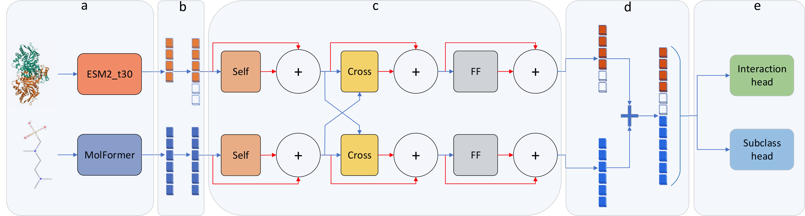
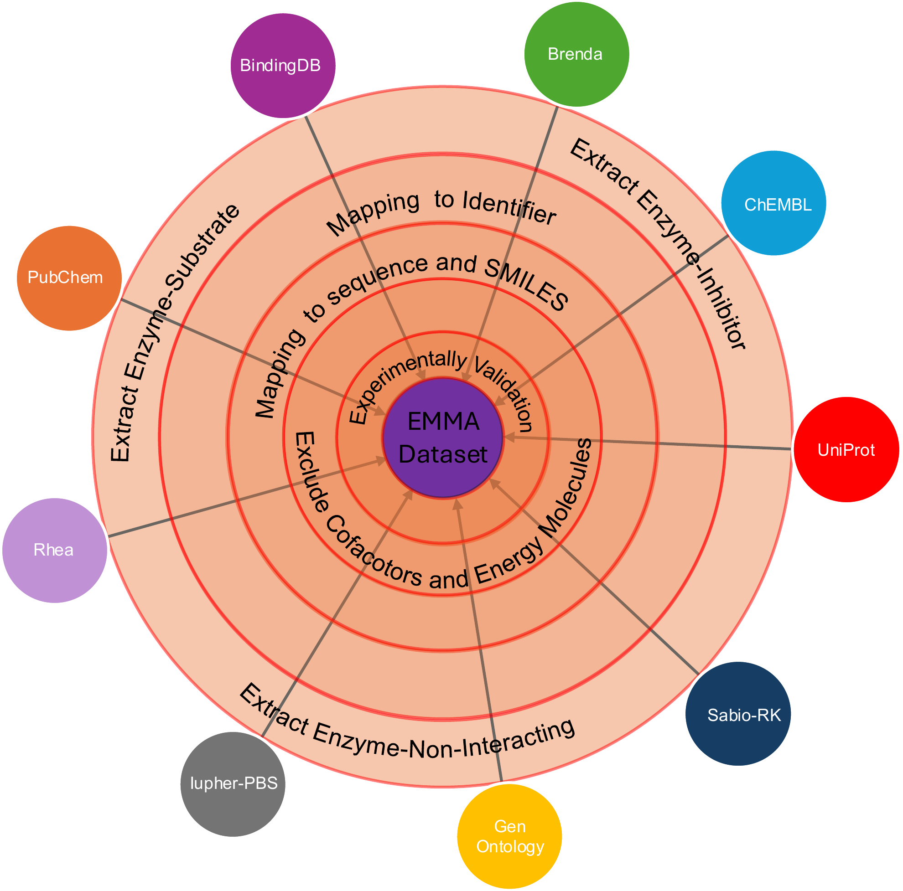

*Figure 1: The overall architecture of the EMMA multi-task learning framework. Self, Cross and FF are abbreviations 
for self-attention and cross-attention and feed-forward, respectively. Red arrows represent residual connection followed by 
normalization (summation sign). (a) Modality-specific encoders. (b) Projection block. (c) Dual-stream transformer mechanisms. 
(d) Concatenation. (e) Task-specific prediction heads.*
# Description:
Predicting enzyme–small molecule interactions is critical for drug discovery. 
While recent deep learning approaches have shown promising results, several challenges remain: 
the lack of a comprehensive dataset, the need to capture enzyme–small molecule interaction signals, 
the tendency of previous models to simplify the problem as enzyme–substrate vs. enzyme--non-interacting, 
thereby, misclassify enzyme–inhibitor pairs as substrates, and the true impact of data leakage on model performance. 
To address these issues, we present EMMA, a transformer-based multi-task learning framework designed to 
learn pairwise interaction signals between enzymes and small molecules while adapting to out-of-distribution data. 
EMMA operates directly on SMILES strings and enzyme sequences, 
with two classification heads that distinguish enzyme–substrate, enzyme–non-interacting, and enzyme–inhibitor pairs. 
By evaluating EMMA under four distinct data-splitting regimes that control for different types of leakage, 
we demonstrate that EMMA achieves strong and robust performance, particularly on novel enzyme–small molecule combinations. 

## Table of Contents:
- [Setup Instructions](#setup-instructions)
  - [Folder Structure](#folder-structure)
  - [Setting up `EMMA` Environment](#setting-up-sip-environment)
- [EMMA Dataset](#data-preparation)
  - [1-DataPreparation.py](#data-preparation)
- [Splitting Data](#splitting-data-)
  - [2-1-SplitByDataSAIL.py](#2-1-splitbydatasailpy)
  - [2-2-SplitByESP.py](#2-2-splitbyesppy)
- [Training EMMA model](#hyperparameter-optimization-and-model-training)
  - [3-1-HyperOp_TraningXgb_2Splits.py](#3-1-hyperop_traningxgb_2splitspy)
  - [3-2-HyperOp_TraningXgb_3Splits.py](#3-2-hyperop_traningxgb_3splitspy)

## Setup Instructions:
###  Folder structure:
```
├── EMMA/
│ ├── data/
│ │ ├── Embedded_sequences_t30/
│ │ ├── Embedded_smiles/
│ │ ├── processed_data/
│ │ ├── raw_data/
│ │ ├── splits/
│ │ ├── trained_models/
│ │ └── training_test_results/
│ ├── code/
│ ├── additional_code/
│ ├── utilities/
│ ├── EMMA.png
│ └── README.md

```

### Setting up `EMMA` Environment:
* It is recommended to install the packages in order

* For MacOSX M1 desktop 

      conda create --name ESP_LA python=3.12.0
      conda activate ESP_LA
      conda install mamba -n ESP_LA -c conda-forge
      mamba install -c kalininalab -c conda-forge -c bioconda datasail-lite
      pip install grakel
      pip install xgboost==2.1.0
      pip install biopython==1.84
      pip install torch==2.3.1
      pip install hyperopt==0.2.7
      pip install colorama==0.4.6
      pip install libchebipy==1.0.10

* For server with linux OS

      conda create --name ESP_LA python=3.12.0
      conda activate ESP_LA
      conda install mamba -n ESP_LA -c conda-forge
      mamba install -c kalininalab -c conda-forge -c bioconda datasail
      pip install grakel
      conda install -c bioconda cd-hit
      conda install pytorch torchvision torchaudio pytorch-cuda -c pytorch -c nvidia
      conda install conda-forge::xgboost
      pip install biopython==1.84
      pip install hyperopt==0.2.7
      pip install colorama==0.4.6
      pip install libchebipy==1.0.10
      pip install wandb

## Data Preparation:
<figure>
  
  <figcaption><em>Figure 1: Overview of EMMA dataset processing steps and its sources </em></figcaption>
</figure>

### 1-DataPreparation.py:

* After running this script, the below dataset will be generated:

        dataESP.pkl: Original ESP data containing only positive data points with experimental evidence.

## Splitting Data:
* This table outlines an overview of all different split strategies we used in this project.

| Method   | Cross-val (Y/N) | Train Samples | Val Samples | Test Samples | Train Neg/Pos | Val Neg/Pos | Test Neg/Pos |
|----------|----------------|---------------|-------------|--------------|---------------|-------------|--------------|
| S1ₗ      | Y              | 55430         | n.a.        | 13901        | 2.78          | n.a.        | 2.80         |
| S1ₚ      | Y              | 55522         | n.a.        | 13904        | 2.79          | n.a.        | 2.80         |
| I1ₗ      | Y              | 55209         | n.a.        | 13845        | 2.77          | n.a.        | 2.78         |
| I1ₚ      | Y              | 55651         | n.a.        | 13864        | 2.80          | n.a.        | 2.79         |
| ESP      | Y              | 55374         | n.a.        | 14056        | 2.79          | n.a.        | 2.81         |
| S2       | Y              | 32455         | n.a.        | 6913         | 2.79          | n.a.        | 2.78         |
| ESPₛ₂    | Y              | 31444         | n.a.        | 7933         | 2.78          | n.a.        | 2.82         |
| S1ₗ      | N              | 48489         | 6825        | 13839        | 2.78          | 2.73        | 2.78         |
| S1ₚ      | N              | 48497         | 6941        | 13919        | 2.78          | 2.79        | 2.80         |
| I1ₗ      | N              | 48938         | 6966        | 12121        | 2.82          | 2.80        | 2.31         |
| I1ₚ      | N              | 48660         | 6982        | 13844        | 2.78          | 2.81        | 2.80         |
| ESP      | N              | 48541         | 7008        | 14034        | 2.79          | 2.82        | 2.82         |
| S2       | N              | 25604         | 1837        | 3622         | 2.77          | 2.73        | 2.75         |
| ESPₛ₂    | N              | 22128         | 3095        | 6344         | 2.81          | 2.90        | 2.83         |

* DataSAIL can split data in 1 and 2 dimensions (1D, 2D). The 1D splits are [S1ₗ (or C1e), S1ₚ (or C1f), I1ₗ (or I1e), I1ₚ (or I1f)] and the 2D splits are S2 (or C2) and I2. We used S2 and all 1D splits in this project. For more information please check the DataSAIL's [documentation](https://datasail.readthedocs.io/en/latest/index.html).
* In this project we refer to the split method that was used in the ESP paper as ESP split.
### 2-1-SplitByDataSAIL.py:
* This script aims to split the dataESP by DataSAIL and generate negative data for each split.

       python 2-1-SplitByDataSAIL.py --split-method [C2, C1e, C1f, I1e I1f] --split-size [8 2, 7 2 1] --input-path 

* Explanation of Arguments:

       --split-method [C2, C1e, C1f, I1e, I1f]: Different split methods provided by DataSAIL.
       --split-size [8 2, 7 2 1]: Defines the number of splits for each method.
       --input-path  ./../data/data_ESP/dataESP.pkl


* Example:

        python 2-1-SplitByDataSAIL.py --split-method C1e --split-size 8 2 --input-path  ./../data/data_ESP/dataESP.pkl

* Output files:

      ./ESP_Leak_Analysis/data/2splits/train_C1e_2S.pkl
      ./ESP_Leak_Analysis/data/2splits/test_C1e_2S.pkl
      ./ESP_Leak_Analysis/data/Reports/Report_C1e_2S.log

### 2-2-SplitByESP.py:
* This script aims to generate a control set for 1D abd 2D splits produced by dataSAIL and then creates negative data for each split. The original ESP dataset contains some missing (NaN) data, and for some molecules, we couldn't find the SMILES string. Additionally, during parsing with dataSAIL, some molecules had invalid SMILES strings. Consequently, the size of the dataset is smaller than the original ESP dataset.

* Explanation of Arguments:

      python 2-2-SplitByESP.py  --split-size [8 2, 7 2 1] --input-path 

* `--split-size` and `--input-path ` are same as `2-1-SplitByDataSAIL.py`


* Example:

      python 2-2-SplitByESP.py  --split-size 8 2 --input-path  ./../data/data_ESP/dataESP.pkl

* Output files:

      ./ESP_Leak_Analysis/data/2splits/train_ESP_2S.pkl
      ./ESP_Leak_Analysis/data/2splits/test_ESP_2S.pkl
      ./ESP_Leak_Analysis/data/Reports/split_report/Report_ESP_2S.log


## Hyperparameter optimization and model training:

### 3-1-HyperOp_TraningXgb_2Splits.py:
* This script aims to tune the hyperparameters and train xgboost model for each split methods produced under 2 splits (train:test) scenario

       python 3-1-HyperOp_TraningXgb_2Splits.py --split-data [C2,C1e, C1f, I1e, I1f,ESP, ESPC2] --column-name [ECFP, PreGNN]
* Explanation of Arguments:
* `--split-data` is same as before 
* `--column-name` determines which embedded vector for the molecule should be concatenated with the ESMb1ts vector for hyperparameter optimization and training.
### 3-2-HyperOp_TraningXgb_3Splits.py:
* This script aims to tune the hyperparameters and train xgboost model for each split methods produced under 3 splits (train:test:val) scenario
* Explanation of Arguments: The Arguments are same as `3-1-HyperOp_TraningXgb_2Splits.py`
